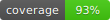
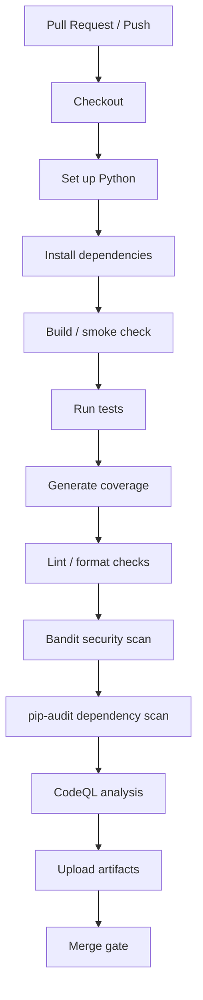

# CloudVault Web

[](https://github.com/codewithsach/cloudvault-web/actions/workflows/ci-cd.yml)
[](https://github.com/codewithsach/cloudvault-web/actions/workflows/codeql.yml)



CloudVault Web is a Flask web application for encrypted multi-user file storage. Users can register, log in, upload encrypted files, request access to files, and download approved files. Admin users can review users and approve or deny access requests.

## Tech Stack

- Backend: Flask
- Database: SQLite with Flask-SQLAlchemy
- Authentication: Flask-Login
- Encryption: Fernet from `cryptography`
- UI: Bootstrap 5
- Tests: pytest and pytest-cov
- Quality/security tools: Ruff, Black, Bandit, pip-audit, CodeQL

## Main Features

- Homepage with login/register actions
- User registration and login
- Account/profile page with user details and activity counts
- Role-based access control
- File upload with validation and encrypted storage
- File download for owners
- File delete for owners
- Access request workflow
- Admin panel with user details and readable request display
- Bootstrap-styled responsive templates

## Routes

- `/` - homepage
- `/register` - register a user
- `/login` - log in
- `/logout` - log out
- `/dashboard` - authenticated dashboard
- `/account` - profile/account summary
- `/upload` - upload a file
- `/my-files` - view owned files
- `/download/<file_id>` - download an owned file
- `/delete-file/<file_id>` - delete an owned file
- `/request-access` - request access to a file
- `/my-requests` - view current user's access requests
- `/download-request/<request_id>` - download through an approved request
- `/admin` - admin panel
- `/approve/<request_id>` - approve an access request
- `/deny/<request_id>` - deny an access request

## Local Setup

Create and activate a virtual environment, then install dependencies:

```powershell
python -m venv venv
.\venv\Scripts\Activate.ps1
python -m pip install -r requirements.txt
```

Run the app:

```powershell
python app.py
```

Open:

```text
http://127.0.0.1:5000
```

Default admin user created on first run:

```text
Username: admin
Password: admin123
```

## Environment Variables

Optional variables:

- `SECRET_KEY` - Flask session secret. If omitted, the app generates a temporary key for the current process.
- `FLASK_DEBUG=1` - enables Flask debug mode when running `python app.py`.

Important: the Fernet encryption key is currently generated at startup. Files uploaded before an app restart may not be decryptable after restart. For production, store the encryption key securely in an environment variable or key manager.

## Testing

Run the test suite:

```powershell
python -m pytest -q
```

Run coverage:

```powershell
python -m pytest --cov=. --cov-report=term-missing
```

More details are in `TESTING.md`.

## Quality and Security Checks

```powershell
ruff check .
black --check .
bandit -r . -x tests -f json -o bandit-report.json
pip-audit -r requirements.txt -f json -o pip-audit-report.json
```

If the tool scripts are not on PATH on Windows, run them through Python:

```powershell
python -m ruff check .
python -m black --check .
python -m bandit -r . -x tests -f json -o bandit-report.json
python -m pip_audit -r requirements.txt -f json -o pip-audit-report.json
```

## GitHub Actions

The repository includes:

- `.github/workflows/ci-cd.yml` - tests, coverage, Ruff, Black, Bandit, pip-audit, and a deployment placeholder
- `.github/workflows/codeql.yml` - CodeQL security analysis with extended security and quality queries

The CI/CD workflow uploads these artifacts:

- `coverage-and-test-results` - `coverage.xml`, `test-results.xml`, and `coverage.svg`
- `security-scan-reports` - `bandit-report.json` and `pip-audit-report.json`

No real deployment target is configured yet. The deploy job is a placeholder that runs only after CI passes on `main` or `master`.

## CI/CD Pipeline



## Portfolio Evidence

CI/CD workflow links, artifact names, and report interpretation guidance are in [`docs/ci-cd-evidence.md`](docs/ci-cd-evidence.md).
